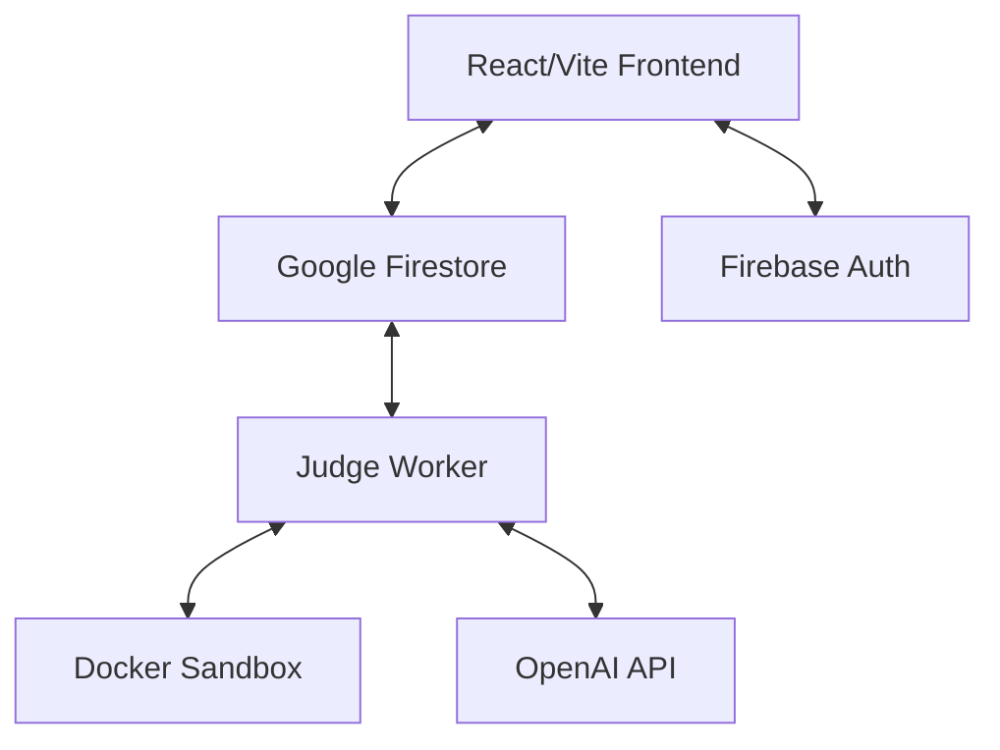

# 🚀 AI Code Reviewer: Full-Stack LeetCode-Style Platform

[](https://github.com/aniruddh2003/ai-code-reviewer)
[](https://github.com/aniruddh2003/ai-code-reviewer)

## 📌 Overview

**AI Code Reviewer** is a high-performance, secure, and AI-driven coding platform. It allows users to solve complex algorithmic challenges in a "LeetCode-style" immersive environment, featuring a real-time Judge Worker, Docker-sandboxed execution, and on-demand AI code reviews with complexity analysis.

---

## ✨ Key Features

- **🏆 LeetCode-Style Interface**: Responsive, glassmorphic UI with integrated Monaco Editor.
- **🌓 Dynamic Theming**: Instant toggle between high-contrast dark and clean light modes.
- **🐳 Secure Docker Sandbox**: Code execution isolated within resource-constrained containers.
- **🤖 AI-Powered Mentorship**: On-demand complexity analysis (Time/Space) and line-level code annotations via OpenAI.
- **⚡ Real-Time Judge Worker**: Asynchronous submission processing with Firestore synchronization.
- **🔐 Robust Authentication**: Secure user sessions and historical submission tracking via Firebase.

---

## 🏗️ Architecture



---

## ⚙️ Tech Stack

- **Frontend**: React 18, Vite, TypeScript, Tailwind CSS, Framer Motion
- **Backend**: Node.js, Firebase Admin SDK
- **Database**: Google Firestore (Real-time NoSQL)
- **Infrastructure**: Docker, Firebase Auth, Google Cloud
- **AI Engine**: OpenAI GPT-4

---

## 🎯 Speckit Strategy (Agentic Coding)

This project follows the **Speckit Workflow**, a rigorous agentic coding methodology:

1.  **Specify**: Natural language requirements are distilled into `spec.md`.
2.  **Plan**: Technical architecture and data models are defined in `plan.md`.
3.  **Task**: Decomposed atomic, dependency-ordered tasks are tracked in `tasks.md`.
4.  **Implement**: Iterative building with automated status synchronization via GitHub Issues.

---

## 🚀 Getting Started

### 1. Initial Setup

```bash
git clone https://github.com/aniruddh2003/ai-code-reviewer.git
cd ai-code-reviewer
npm install
```

### 2. Environment Configuration

Create a `.env` file from the template and add your credentials:
- `FIREBASE_API_KEY`
- `OPENAI_API_KEY`

### 3. Launch Development Server

```bash
# Frontend
cd frontend && npm run dev

# Judge Worker
cd backend && npm start
```

---

## 📜 API & Contracts

Details on submission schemas and Firestore Security Rules can be found in the [Specs Directory](specs/).

---

## 👨‍💻 Author

**Aniruddha Bandyopadhyay**
- [GitHub](https://github.com/aniruddh2003)
- [Project Ledger](docs/devlog/)

---

> [!TIP]
> Use the command `/util-speckit.status` in the agent terminal to see real-time progress of ongoing features!
